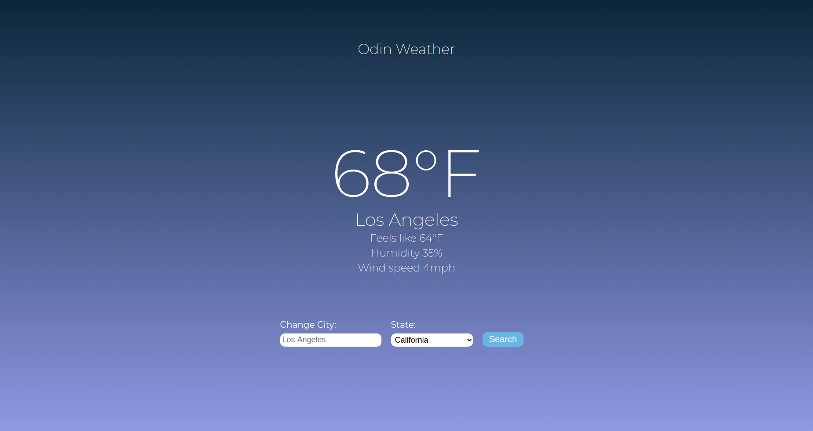

The purpose of this project was to practice asynchronous javascript and react programming using a third party weather API.

Visit this project live at: https://jmart6784.github.io/odin-weather/

OR

Run the project locally (prerequisites: yarn, npm):

1. Download or clone the repository.
2. Open the terminal inside the root of the project and run:
2. yarn install
3. yarn start